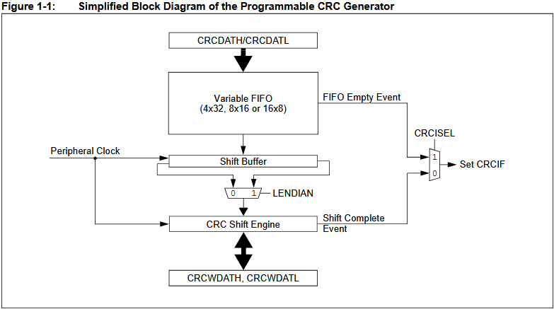

Okay, this is the **architectural diagram of the CRC hardware module** inside the microcontroller. Let's break it down into its components, like an engine blueprint.

---

### 🧱 **Main components (blocks):**

1. **`CRCDATH/CRCDATL` (CRC Data High/Low Registers)**
* **What is it:** These are **input data registers**. This is where your program (CPU) writes the data for which you need to calculate the CRC.
    * **Analogy:** You put the raw food on the chef's cutting table (CRC module).

2.  **`Variable FIFO` (First In, First Out)**
    * **What is it:** **Buffer queue**. It can be configured in different ways:
        * `4x32` — 4 cells of 32 bits each
        * `8x16` — 8 cells of 16 bits each
        * `16x8` — 16 cells of 8 bits each
    * **Why:** So that the CPU can quickly "dump" several chunks of data in a row into the CRC module, without waiting for the module to process each chunk immediately. The CPU is faster than the CRC module, and FIFO smooths out this difference.
    * **Analogy:** The conveyor belt on which the products are placed. The cook takes them one at a time, and in the meantime you can put the next ones.

3.  **`FIFO Empty Event`**
    * **What is it:** **Signal (interrupt)**, which is generated when the FIFO becomes empty.
    * **Why:** To tell the CPU that a new piece of data can be loaded. This is the interaction between a fast CPU and a relatively slow peripheral module.

4.  **`Peripheral Clock`**
    * **What is it:** **Clock signal** for the CRC module. Each "movement" of data inside the module (shift, calculation) occurs synchronously with this clock signal.
    * **Analogy:** Heartbeat or metronome for the entire module.

5. **`Shift Buffer'**
    * **What is it:** **Shift register**. This is the heart of CRC calculation. It takes data from the FIFO and shifts it bitwise (or byte-wise), simultaneously performing an XOR operation with a polynomial.
    * **Analogy:** A mechanical gear that turns data by mixing it with a "key" (a polynomial).

6. **`CRC Engine'**
* **What is it:** **A logic circuit** that implements the CRC algorithm. It contains registers for storing the current state of calculations (CRC accumulator) and a circuit that performs an XOR operation with a generator polynomial.
    * **Analogy:** The brain of a cook who prepares a dish according to a well-known recipe (polyamory).

7.  **`Shift Complete Event`**
    * **What is it:** **Signal (interrupt)**, which is generated when the processing of the current data portion is completed.
    * **Why:** To notify the CPU that you can either read the result or download the following data.

8.  **`CRCWDATH, CRCWDATL` (CRC Working Data High/Low)**
    * **What is it:** **Output registers/accumulator**. The current, not yet final CRC value is stored here throughout all calculations. The CPU can read it during operation.
    * **Analogy:** A bowl in which the cook mixes the ingredients. You can take a look at the intermediate result.

9.  **`CRCISEL` (CRC Input Select)**
    * **What is it:** **Multiplexer** or data source selection logic.
    * **Why:** To choose where to get the CRC calculation data from: directly from `CRCDATH/CRCDATL` or from FIFO. This provides flexibility.

10. **`Set CRCIF` (Set CRC Interrupt Flag)**
    * **What is it:** **Setting the interrupt flag**. This signal sets a flag in the status register that tells the CPU that some event has occurred (for example, the calculation has completed or the FIFO has been emptied).
    * **Why:** So that the CPU can respond to the events of the CRC module not by constantly polling it (polling), but by interrupts (interrupt), which is much more efficient.

---

### 🔄 **How it all works together (data flow):**

1. **Download:** The CPU writes data to the `CRCDATH/CRCDATL` registers.
2. **Buffering:** The data goes into the `FIFO'.
3. **Selection:** The `CRCISEL` logic takes turns selecting data from the `FIFO` and feeding it to the `Shift Buffer`.
4. **Calculation:** The 'CRC Engine` processes the data in the `Shift Buffer', updating the intermediate result in the `CRCWDATH/CRCWDATL`.
5. **Sync:** All this happens to the beat of the `Peripheral Clock'.
6. **Alarm system:** The module generates events (`FIFO Empty Event`, `Shift Complete Event`) and sets interrupt flags (`Set CRCIF`) so that the CPU knows what is happening.
7. **Result:** After processing all the data, the final result remains in the accumulator (`CRCWDATH/CRCWDATL`), and the CPU can read it.

This scheme is an ideal example of how a hardware module offloads the CPU from heavy calculations and works with data independently, requiring only minimal intervention from the program.