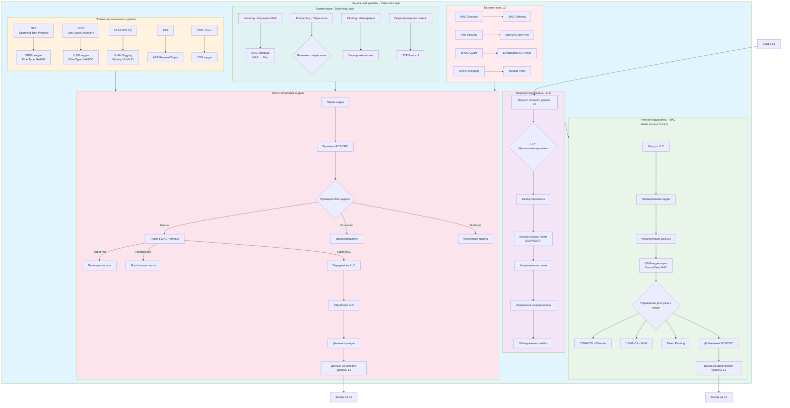

```mermaid
flowchart TD
    subgraph L2 [Канальный уровень - Data Link Layer]
        direction TB
        subgraph LLC_SUB [Верхний подуровень - LLC<br/>Logical Link Control]
            LLC_IN[Вход от сетевого уровня L3] --> LLC_MUX{LLC Мультиплексирование}
            
            LLC_MUX --> LLC_PROTOCOL[Выбор протокола]
            LLC_PROTOCOL --> LLC_SAP[Service Access Points<br/>DSAP/SSAP]
            LLC_SAP --> LLC_FLOW[Управление потоком]
            LLC_FLOW --> LLC_SEQ[Управление очередностью]
            LLC_SEQ --> LLC_ERROR[Обнаружение ошибок]
        end

        subgraph MAC_SUB [Нижний подуровень - MAC<br/>Media Access Control]
            MAC_IN[Вход от LLC] --> MAC_FRAME[Формирование кадра]
            MAC_FRAME --> MAC_ENC[Инкапсуляция данных]
            MAC_ENC --> MAC_ADDR[DMA-адресация<br/>Source/Dest MAC]
            MAC_ADDR --> MAC_ACCESS{Управление доступом к среде}
            
            MAC_ACCESS --> CSMA_CD[CSMA/CD - Ethernet]
            MAC_ACCESS --> CSMA_CA[CSMA/CA - Wi-Fi]
            MAC_ACCESS --> TOKEN_RING[Token Passing]
            
            MAC_ACCESS --> MAC_FCS[Добавление FCS/CRC]
            MAC_FCS --> MAC_OUT[Выход на физический уровень L1]
        end

        subgraph PROTOCOLS [Протоколы канального уровня]
            direction TB
            P_STP[STP<br/>Spanning Tree Protocol] --> P_BPDU[BPDU кадры<br/>EtherType: 0x4242]
            P_LLDP[LLDP<br/>Link Layer Discovery] --> P_LLDP_FRAME[LLDP кадры<br/>EtherType: 0x88CC]
            P_VLAN[VLAN 802.1Q] --> P_TAGGING[VLAN Tagging<br/>Priority, VLAN ID]
            P_ARP[ARP] --> P_ARP_REQ[ARP Request/Reply]
            P_CDP[CDP - Cisco] --> P_CDP_FRAME[CDP кадры]
        end

        subgraph FRAME_FLOW [Поток обработки кадров]
            direction LR
            FF_RX[Прием кадра] --> FF_CHECK[Проверка FCS/CRC]
            FF_CHECK --> FF_DEST{Проверка MAC-адреса}
            FF_DEST -->|Unicast| FF_MAC_TABLE[Поиск в MAC-таблице]
            FF_DEST -->|Broadcast| FF_BROADCAST[Широковещание]
            FF_DEST -->|Multicast| FF_MULTICAST[Мультикаст группа]
            
            FF_MAC_TABLE -->|Известен| FF_FORWARD[Передача на порт]
            FF_MAC_TABLE -->|Неизвестен| FF_FLOOD[Flood на все порты]
            FF_MAC_TABLE -->|Свой MAC| FF_UPLINK[Передача на LLC]
            
            FF_UPLINK --> FF_LLC_PROC[Обработка LLC]
            FF_LLC_PROC --> FF_DECAP[Деинкапсуляция]
            FF_DECAP --> FF_TO_L3[Данные на сетевой уровень L3]
        end

        subgraph SWITCHING [Коммутация - Switching Logic]
            direction TB
            S_LEARNING[Learning - Изучение MAC] --> S_MAC_TABLE[MAC-таблица<br/>MAC → Port]
            S_FORWARDING[Forwarding - Пересылка] --> S_DECISION{Решение о пересылке}
            S_FILTERING[Filtering - Фильтрация] --> S_BLOCK[Блокировка петель]
            S_LOOP_PREVENTION[Предотвращение петель] --> S_STP[STP Protocol]
        end

        subgraph SECURITY [Безопасность L2]
            S_MAC_SEC[MAC Security] --> S_MAC_FILTER[MAC Filtering]
            S_PORT_SEC[Port Security] --> S_MAX_MAC[Max MAC per Port]
            S_BPDU_GUARD[BPDU Guard] --> S_BLOCK_BPDU[Блокировка STP атак]
            S_DHCP_SNOOP[DHCP Snooping] --> S_TRUST_PORTS[Trusted Ports]
        end
    end

    %% Связи между блоками
    LLC_SUB --> MAC_SUB
    PROTOCOLS --> FRAME_FLOW
    SWITCHING --> FRAME_FLOW
    SECURITY --> FRAME_FLOW
    
    %% Входы/выходы
    L3_IN[Вход с L3] --> LLC_IN
    MAC_OUT --> L1_OUT[Выход на L1]
    FF_TO_L3 --> L3_OUT[Выход на L3]
    
    %% Стили
    classDef l2 fill:#e1f5fe
    classDef llc fill:#f3e5f5
    classDef mac fill:#e8f5e8
    classDef protocol fill:#fff3e0
    classDef flow fill:#fce4ec
    classDef switch fill:#e0f2f1
    classDef security fill:#ffebee
    
    class L2 l2
    class LLC_SUB llc
    class MAC_SUB mac
    class PROTOCOLS protocol
    class FRAME_FLOW flow
    class SWITCHING switch
    class SECURITY security
```
