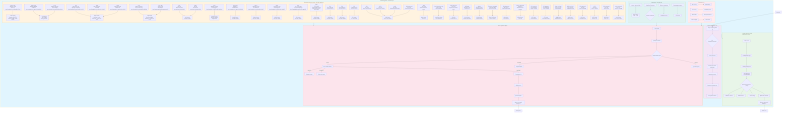

```mermaid
flowchart TD
    subgraph L2 [Канальный уровень - Data Link Layer]
        direction TB
        subgraph LLC_SUB [Верхний подуровень - LLC<br/>Logical Link Control]
            LLC_IN[Вход от сетевого уровня L3] --> LLC_MUX{LLC Мультиплексирование}
            
            LLC_MUX --> LLC_PROTOCOL[Выбор протокола]
            LLC_PROTOCOL --> LLC_SAP[Service Access Points<br/>DSAP/SSAP]
            LLC_SAP --> LLC_FLOW[Управление потоком]
            LLC_FLOW --> LLC_SEQ[Управление очередностью]
            LLC_SEQ --> LLC_ERROR[Обнаружение ошибок]
        end

        subgraph MAC_SUB [Нижний подуровень - MAC<br/>Media Access Control]
            MAC_IN[Вход от LLC] --> MAC_FRAME[Формирование кадра]
            MAC_FRAME --> MAC_ENC[Инкапсуляция данных]
            MAC_ENC --> MAC_ADDR[DMA-адресация<br/>Source/Dest MAC]
            MAC_ADDR --> MAC_ACCESS{Управление доступом к среде}
            
            MAC_ACCESS --> CSMA_CD[CSMA/CD - Ethernet]
            MAC_ACCESS --> CSMA_CA[CSMA/CA - Wi-Fi]
            MAC_ACCESS --> TOKEN_RING[Token Passing]
            
            MAC_ACCESS --> MAC_FCS[Добавление FCS/CRC]
            MAC_FCS --> MAC_OUT[Выход на физический уровень L1]
        end

    subgraph PROTOCOLS [Протоколы канального уровня - RFC/IEEE Standards]
        direction TB
        
        %% IEEE 802.3 Standards - MAC Layer
        P_ETHERNET[Ethernet MAC<br/>IEEE 802.3-2018<br/>MAC Layer<br/>https://standards.ieee.org/ieee/802.3/7043/] --> P_MAC[MAC Framing<br/>Preamble, SFD, FCS<br/>EtherType range: 0x0000-0x05DC]
        
        %% IEEE 802.1Q Standards - VLAN
        P_VLAN[VLAN Tagging<br/>IEEE 802.1Q-2018<br/>Virtual LAN<br/>https://standards.ieee.org/ieee/802.1Q/6847/] --> P_TAGGING[VLAN Tagging<br/>TPID: 0x8100<br/>Priority, VLAN ID]
        P_QINQ[Q-in-Q<br/>IEEE 802.1ad-2005<br/>Provider Bridges<br/>https://standards.ieee.org/ieee/802.1ad/2919/] --> P_TAGGING
        
        %% STP Family - IEEE 802.1D
        P_STP[STP<br/>IEEE 802.1D-2004<br/>Spanning Tree Protocol<br/>https://standards.ieee.org/ieee/802.1D/3297/] --> P_BPDU[BPDU Frames<br/>EtherType: 0x4242<br/>Destination: 01-80-C2-00-00-00]
        P_RSTP[RSTP<br/>IEEE 802.1w-2001<br/>Rapid STP<br/>https://standards.ieee.org/ieee/802.1w/2945/] --> P_BPDU
        P_MSTP[MSTP<br/>IEEE 802.1s-2002<br/>Multiple STP<br/>https://standards.ieee.org/ieee/802.1s/2947/] --> P_BPDU
        
        %% LLDP - IEEE 802.1AB
        P_LLDP[LLDP<br/>IEEE 802.1AB-2016<br/>Link Layer Discovery<br/>https://standards.ieee.org/ieee/802.1AB/5999/] --> P_LLDP_FRAME[LLDP Frames<br/>EtherType: 0x88CC<br/>Destination: 01-80-C2-00-00-0E]
        P_LLDP_MED[LLDP-MED<br/>ANSI/TIA-1057<br/>Media Endpoint<br/>https://webstore.ansi.org/standards/tia/tia1057] --> P_LLDP_FRAME
        
        %% ARP - RFC Standards
        P_ARP[ARP<br/>RFC 826<br/>Address Resolution<br/>https://tools.ietf.org/html/rfc826] --> P_ARP_FRAME[ARP Packets<br/>EtherType: 0x0806]
        P_RARP[RARP<br/>RFC 903<br/>Reverse ARP<br/>https://tools.ietf.org/html/rfc903] --> P_ARP_FRAME
        
        %% LACP - IEEE 802.1AX
        P_LACP[LACP<br/>IEEE 802.1AX-2020<br/>Link Aggregation<br/>https://standards.ieee.org/ieee/802.1AX/6960/] --> P_LACP_FRAME[LACPDU Frames<br/>EtherType: 0x8809<br/>Subtype: 0x01]
        
        %% Flow Control - IEEE 802.3x
        P_PAUSE[Flow Control<br/>IEEE 802.3x<br/>PAUSE Frames<br/>https://standards.ieee.org/ieee/802.3/7043/] --> P_PAUSE_FRAME[PAUSE Frames<br/>EtherType: 0x8808]
        
        %% 802.1X Authentication
        P_DOT1X[802.1X<br/>IEEE 802.1X-2010<br/>Port-based Auth<br/>https://standards.ieee.org/ieee/802.1X/4007/] --> P_EAPOL[EAPOL Frames<br/>EtherType: 0x888E]
        
        %% MVRP - IEEE 802.1Q
        P_MVRP[MVRP<br/>IEEE 802.1Q-2018<br/>VLAN Registration<br/>https://standards.ieee.org/ieee/802.1Q/6847/] --> P_MVRP_FRAME[MVRP Frames<br/>EtherType: 0x88F5]
        
        %% CFM - IEEE 802.1ag
        P_CFM[CFM<br/>IEEE 802.1ag-2007<br/>Connectivity Fault Mgmt<br/>https://standards.ieee.org/ieee/802.1ag/3295/] --> P_CFM_FRAME[CFM Frames<br/>EtherType: 0x8902]
        
        %% ERPS - ITU-T G.8032
        P_ERPS[ERPS<br/>ITU-T G.8032<br/>Ethernet Ring Protection<br/>https://www.itu.int/rec/T-REC-G.8032] --> P_ERPS_FRAME[RAPS Frames<br/>EtherType: 0x88F6]
        
        %% Proprietary Protocols
        P_CDP[CDP<br/>Cisco Proprietary<br/>Discovery Protocol] --> P_CDP_FRAME[CDP Frames<br/>EtherType: 0x2000]
        P_EDP[EDP<br/>Extreme Networks<br/>Discovery Protocol] --> P_EDP_FRAME[EDP Frames<br/>EtherType: 0x88A6]
        P_FDP[FDP<br/>Foundry Networks<br/>Discovery Protocol] --> P_FDP_FRAME[FDP Frames<br/>LLC DSAP: 0xAA]

        %% === ДОБАВЛЕННЫЕ ПРОТОКОЛЫ ===
        
        %% PPP Protocols
        P_PPP[PPP<br/>RFC 1661<br/>Point-to-Point Protocol] --> P_PPP_FRAME[PPP Frames<br/>Protocol field: 0x0021]
        P_PPTP[PPTP<br/>RFC 2637<br/>Point-to-Point Tunneling] --> P_PPP_FRAME
        P_CHAP[CHAP<br/>RFC 1994<br/>Challenge Handshake Auth] --> P_PPP_FRAME
        P_PAP[PAP:::deprecated<br/>RFC 1334<br/>Password Auth Protocol] --> P_PPP_FRAME
        
        %% WAN Protocols
        P_HDLC[HDLC<br/>ISO 13239<br/>High-Level Data Link Control] --> P_HDLC_FRAME[HDLC Frames<br/>Flag: 0x7E]
        P_FRAMERELAY[Frame Relay:::deprecated<br/>ANSI T1.618<br/>Packet Switching] --> P_FR_FRAME[Frame Relay Frames<br/>DLCI addressing]
        P_ATM[ATM:::deprecated<br/>ITU-T I.361<br/>Asynchronous Transfer Mode] --> P_ATM_CELL[ATM Cells<br/>53-byte fixed size]
        
        %% Wireless Protocols
        P_WIFI[WiFi/WLAN<br/>IEEE 802.11-2020<br/>Wireless LAN] --> P_WIFI_FRAME[802.11 Frames<br/>Multiple frame types]
        P_WIMAX[WiMAX<br/>IEEE 802.16-2017<br/>Broadband Wireless] --> P_WIMAX_FRAME[802.16 Frames<br/>TDD/FDD framing]
        
        %% Legacy and Specialized
        P_TOKENRING[Token Ring:::deprecated<br/>IEEE 802.5-1998<br/>Token Passing Ring] --> P_TR_FRAME[Token Ring Frames<br/>Starting Delimiter]
        P_FDDI[FDDI:::deprecated<br/>ANSI X3T9.5<br/>Fiber Distributed Data] --> P_FDDI_FRAME[FDDI Frames<br/>Fiber optic ring]
        P_ARCNET[ARCnet:::deprecated<br/>ANSI 878.1<br/>Attached Resource Computer] --> P_ARCNET_FRAME[ARCnet Frames<br/>Token bus]
        
        %% Trunking Protocols
        P_DTP[DTP:::proprietary<br/>Cisco Proprietary<br/>Dynamic Trunking] --> P_DTP_FRAME[DTP Frames<br/>VLAN negotiation]
        P_VTP[VTP:::proprietary<br/>Cisco Proprietary<br/>VLAN Trunking] --> P_VTP_FRAME[VTP Frames<br/>VLAN database sync]
        P_PAGP[PAgP:::proprietary<br/>Cisco Proprietary<br/>Port Aggregation] --> P_PAGP_FRAME[PAgP Frames<br/>EtherType: 0x0104]
        
        %% Other Important Protocols
        P_NDP[NDP:::proprietary<br/>Nortel Discovery<br/>Neighbor Discovery] --> P_NDP_FRAME[NDP Frames<br/>Proprietary format]
        P_L2F[L2F:::deprecated<br/>RFC 2341<br/>Layer 2 Forwarding] --> P_L2F_FRAME[L2F Frames<br/>Tunneling protocol]
        P_L2TP[L2TP<br/>RFC 2661<br/>Layer 2 Tunneling] --> P_L2TP_FRAME[L2TP Packets<br/>UDP port 1701]
        P_SLIP[SLIP:::deprecated<br/>RFC 1055<br/>Serial Line IP] --> P_SLIP_FRAME[SLIP Frames<br/>END: 0xC0]
        P_DCAP[DCAP:::deprecated<br/>RFC 2114<br/>Data Link Switching] --> P_DCAP_FRAME[DCAP Frames<br/>Client Access Protocol]
    end

    classDef deprecated fill:#ffcccc
    classDef proprietary fill:#fff3cd

        subgraph FRAME_FLOW [Поток обработки кадров]
            direction LR
            FF_RX[Прием кадра] --> FF_CHECK[Проверка FCS/CRC]
            FF_CHECK --> FF_DEST{Проверка MAC-адреса}
            FF_DEST -->|Unicast| FF_MAC_TABLE[Поиск в MAC-таблице]
            FF_DEST -->|Broadcast| FF_BROADCAST[Широковещание]
            FF_DEST -->|Multicast| FF_MULTICAST[Мультикаст группа]
            
            FF_MAC_TABLE -->|Известен| FF_FORWARD[Передача на порт]
            FF_MAC_TABLE -->|Неизвестен| FF_FLOOD[Flood на все порты]
            FF_MAC_TABLE -->|Свой MAC| FF_UPLINK[Передача на LLC]
            
            FF_UPLINK --> FF_LLC_PROC[Обработка LLC]
            FF_LLC_PROC --> FF_DECAP[Деинкапсуляция]
            FF_DECAP --> FF_TO_L3[Данные на сетевой уровень L3]
        end

        subgraph SWITCHING [Коммутация - Switching Logic]
            direction TB
            S_LEARNING[Learning - Изучение MAC] --> S_MAC_TABLE[MAC-таблица<br/>MAC → Port]
            S_FORWARDING[Forwarding - Пересылка] --> S_DECISION{Решение о пересылке}
            S_FILTERING[Filtering - Фильтрация] --> S_BLOCK[Блокировка петель]
            S_LOOP_PREVENTION[Предотвращение петель] --> S_STP[STP Protocol]
        end

        subgraph SECURITY [Безопасность L2]
            S_MAC_SEC[MAC Security] --> S_MAC_FILTER[MAC Filtering]
            S_PORT_SEC[Port Security] --> S_MAX_MAC[Max MAC per Port]
            S_BPDU_GUARD[BPDU Guard] --> S_BLOCK_BPDU[Блокировка STP атак]
            S_DHCP_SNOOP[DHCP Snooping] --> S_TRUST_PORTS[Trusted Ports]
        end
    end

    %% Связи между блоками
    LLC_SUB --> MAC_SUB
    PROTOCOLS --> FRAME_FLOW
    SWITCHING --> FRAME_FLOW
    SECURITY --> FRAME_FLOW
    
    %% Входы/выходы
    L3_IN[Вход с L3] --> LLC_IN
    MAC_OUT --> L1_OUT[Выход на L1]
    FF_TO_L3 --> L3_OUT[Выход на L3]
    
    %% Стили
    classDef l2 fill:#e1f5fe
    classDef llc fill:#f3e5f5
    classDef mac fill:#e8f5e8
    classDef protocol fill:#fff3e0
    classDef flow fill:#fce4ec
    classDef switch fill:#e0f2f1
    classDef security fill:#ffebee
    
    class L2 l2
    class LLC_SUB llc
    class MAC_SUB mac
    class PROTOCOLS protocol
    class FRAME_FLOW flow
    class SWITCHING switch
    class SECURITY security
```
