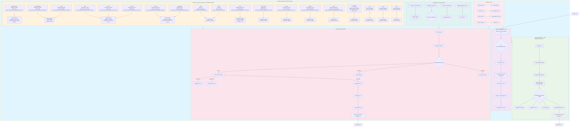

```mermaid
flowchart TD
    subgraph L2 [Канальный уровень - Data Link Layer]
        direction TB
        subgraph LLC_SUB [Верхний подуровень - LLC<br/>Logical Link Control]
            LLC_IN[Вход от сетевого уровня L3] --> LLC_MUX{LLC Мультиплексирование}
            
            LLC_MUX --> LLC_PROTOCOL[Выбор протокола]
            LLC_PROTOCOL --> LLC_SAP[Service Access Points<br/>DSAP/SSAP]
            LLC_SAP --> LLC_FLOW[Управление потоком]
            LLC_FLOW --> LLC_SEQ[Управление очередностью]
            LLC_SEQ --> LLC_ERROR[Обнаружение ошибок]
        end

        subgraph MAC_SUB [Нижний подуровень - MAC<br/>Media Access Control]
            MAC_IN[Вход от LLC] --> MAC_FRAME[Формирование кадра]
            MAC_FRAME --> MAC_ENC[Инкапсуляция данных]
            MAC_ENC --> MAC_ADDR[DMA-адресация<br/>Source/Dest MAC]
            MAC_ADDR --> MAC_ACCESS{Управление доступом к среде}
            
            MAC_ACCESS --> CSMA_CD[CSMA/CD - Ethernet]
            MAC_ACCESS --> CSMA_CA[CSMA/CA - Wi-Fi]
            MAC_ACCESS --> TOKEN_RING[Token Passing]
            
            MAC_ACCESS --> MAC_FCS[Добавление FCS/CRC]
            MAC_FCS --> MAC_OUT[Выход на физический уровень L1]
        end

        subgraph PROTOCOLS [Протоколы канального уровня - RFC/IEEE Standards]
    direction TB
    
    %% IEEE 802.3 Standards - MAC Layer
    P_ETHERNET[Ethernet MAC<br/>IEEE 802.3-2018<br/>MAC Layer<br/>https://standards.ieee.org/ieee/802.3/7043/] --> P_MAC[MAC Framing<br/>Preamble, SFD, FCS<br/>EtherType range: 0x0000-0x05DC]
    
    %% IEEE 802.1Q Standards - VLAN
    P_VLAN[VLAN Tagging<br/>IEEE 802.1Q-2018<br/>Virtual LAN<br/>https://standards.ieee.org/ieee/802.1Q/6847/] --> P_TAGGING[VLAN Tagging<br/>TPID: 0x8100<br/>Priority, VLAN ID]
    P_QINQ[Q-in-Q<br/>IEEE 802.1ad-2005<br/>Provider Bridges<br/>https://standards.ieee.org/ieee/802.1ad/2919/] --> P_TAGGING
    
    %% STP Family - IEEE 802.1D
    P_STP[STP<br/>IEEE 802.1D-2004<br/>Spanning Tree Protocol<br/>https://standards.ieee.org/ieee/802.1D/3297/] --> P_BPDU[BPDU Frames<br/>EtherType: 0x4242<br/>Destination: 01-80-C2-00-00-00]
    P_RSTP[RSTP<br/>IEEE 802.1w-2001<br/>Rapid STP<br/>https://standards.ieee.org/ieee/802.1w/2945/] --> P_BPDU
    P_MSTP[MSTP<br/>IEEE 802.1s-2002<br/>Multiple STP<br/>https://standards.ieee.org/ieee/802.1s/2947/] --> P_BPDU
    
    %% LLDP - IEEE 802.1AB
    P_LLDP[LLDP<br/>IEEE 802.1AB-2016<br/>Link Layer Discovery<br/>https://standards.ieee.org/ieee/802.1AB/5999/] --> P_LLDP_FRAME[LLDP Frames<br/>EtherType: 0x88CC<br/>Destination: 01-80-C2-00-00-0E]
    P_LLDP_MED[LLDP-MED<br/>ANSI/TIA-1057<br/>Media Endpoint<br/>https://webstore.ansi.org/standards/tia/tia1057] --> P_LLDP_FRAME
    
    %% ARP - RFC Standards
    P_ARP[ARP<br/>RFC 826<br/>Address Resolution<br/>https://tools.ietf.org/html/rfc826] --> P_ARP_FRAME[ARP Packets<br/>EtherType: 0x0806]
    P_RARP[RARP<br/>RFC 903<br/>Reverse ARP<br/>https://tools.ietf.org/html/rfc903] --> P_ARP_FRAME
    
    %% LACP - IEEE 802.1AX
    P_LACP[LACP<br/>IEEE 802.1AX-2020<br/>Link Aggregation<br/>https://standards.ieee.org/ieee/802.1AX/6960/] --> P_LACP_FRAME[LACPDU Frames<br/>EtherType: 0x8809<br/>Subtype: 0x01]
    
    %% Flow Control - IEEE 802.3x
    P_PAUSE[Flow Control<br/>IEEE 802.3x<br/>PAUSE Frames<br/>https://standards.ieee.org/ieee/802.3/7043/] --> P_PAUSE_FRAME[PAUSE Frames<br/>EtherType: 0x8808]
    
    %% 802.1X Authentication
    P_DOT1X[802.1X<br/>IEEE 802.1X-2010<br/>Port-based Auth<br/>https://standards.ieee.org/ieee/802.1X/4007/] --> P_EAPOL[EAPOL Frames<br/>EtherType: 0x888E]
    
    %% MVRP - IEEE 802.1Q
    P_MVRP[MVRP<br/>IEEE 802.1Q-2018<br/>VLAN Registration<br/>https://standards.ieee.org/ieee/802.1Q/6847/] --> P_MVRP_FRAME[MVRP Frames<br/>EtherType: 0x88F5]
    
    %% CFM - IEEE 802.1ag
    P_CFM[CFM<br/>IEEE 802.1ag-2007<br/>Connectivity Fault Mgmt<br/>https://standards.ieee.org/ieee/802.1ag/3295/] --> P_CFM_FRAME[CFM Frames<br/>EtherType: 0x8902]
    
    %% ERPS - ITU-T G.8032
    P_ERPS[ERPS<br/>ITU-T G.8032<br/>Ethernet Ring Protection<br/>https://www.itu.int/rec/T-REC-G.8032] --> P_ERPS_FRAME[RAPS Frames<br/>EtherType: 0x88F6]
    
    %% Proprietary Protocols
    P_CDP[CDP<br/>Cisco Proprietary<br/>Discovery Protocol] --> P_CDP_FRAME[CDP Frames<br/>EtherType: 0x2000]
    P_EDP[EDP<br/>Extreme Networks<br/>Discovery Protocol] --> P_EDP_FRAME[EDP Frames<br/>EtherType: 0x88A6]
    P_FDP[FDP<br/>Foundry Networks<br/>Discovery Protocol] --> P_FDP_FRAME[FDP Frames<br/>LLC DSAP: 0xAA]
end

        subgraph FRAME_FLOW [Поток обработки кадров]
            direction LR
            FF_RX[Прием кадра] --> FF_CHECK[Проверка FCS/CRC]
            FF_CHECK --> FF_DEST{Проверка MAC-адреса}
            FF_DEST -->|Unicast| FF_MAC_TABLE[Поиск в MAC-таблице]
            FF_DEST -->|Broadcast| FF_BROADCAST[Широковещание]
            FF_DEST -->|Multicast| FF_MULTICAST[Мультикаст группа]
            
            FF_MAC_TABLE -->|Известен| FF_FORWARD[Передача на порт]
            FF_MAC_TABLE -->|Неизвестен| FF_FLOOD[Flood на все порты]
            FF_MAC_TABLE -->|Свой MAC| FF_UPLINK[Передача на LLC]
            
            FF_UPLINK --> FF_LLC_PROC[Обработка LLC]
            FF_LLC_PROC --> FF_DECAP[Деинкапсуляция]
            FF_DECAP --> FF_TO_L3[Данные на сетевой уровень L3]
        end

        subgraph SWITCHING [Коммутация - Switching Logic]
            direction TB
            S_LEARNING[Learning - Изучение MAC] --> S_MAC_TABLE[MAC-таблица<br/>MAC → Port]
            S_FORWARDING[Forwarding - Пересылка] --> S_DECISION{Решение о пересылке}
            S_FILTERING[Filtering - Фильтрация] --> S_BLOCK[Блокировка петель]
            S_LOOP_PREVENTION[Предотвращение петель] --> S_STP[STP Protocol]
        end

        subgraph SECURITY [Безопасность L2]
            S_MAC_SEC[MAC Security] --> S_MAC_FILTER[MAC Filtering]
            S_PORT_SEC[Port Security] --> S_MAX_MAC[Max MAC per Port]
            S_BPDU_GUARD[BPDU Guard] --> S_BLOCK_BPDU[Блокировка STP атак]
            S_DHCP_SNOOP[DHCP Snooping] --> S_TRUST_PORTS[Trusted Ports]
        end
    end

    %% Связи между блоками
    LLC_SUB --> MAC_SUB
    PROTOCOLS --> FRAME_FLOW
    SWITCHING --> FRAME_FLOW
    SECURITY --> FRAME_FLOW
    
    %% Входы/выходы
    L3_IN[Вход с L3] --> LLC_IN
    MAC_OUT --> L1_OUT[Выход на L1]
    FF_TO_L3 --> L3_OUT[Выход на L3]
    
    %% Стили
    classDef l2 fill:#e1f5fe
    classDef llc fill:#f3e5f5
    classDef mac fill:#e8f5e8
    classDef protocol fill:#fff3e0
    classDef flow fill:#fce4ec
    classDef switch fill:#e0f2f1
    classDef security fill:#ffebee
    
    class L2 l2
    class LLC_SUB llc
    class MAC_SUB mac
    class PROTOCOLS protocol
    class FRAME_FLOW flow
    class SWITCHING switch
    class SECURITY security
```
