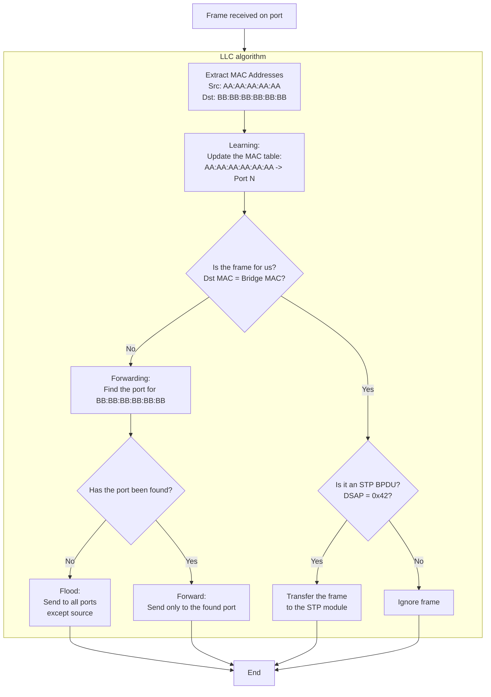

 LLC (Logical Link Control) in a transparent bridge: The complete algorithm of operation

## 🎯 Purpose
LLC is the **central processor** of the bridge. His task is to make a decision for each incoming frame: where and how to forward it.

---

# General scheme of the algorithm



---

## 🧩 Details of each block

### 1. 📥 **Input data**
- **`port_id_t port_num`** is the port number to which the frame arrived
- **`ethernet_frame_t *frame`** — pointer to an Ethernet frame
- **`mac_address_t bridge_mac_address`** is the MAC address of the bridge itself

### 2. 🔍 **Extracting MAC addresses**
```c
src_mac = frame->src_addr; // Sender's MAC
dst_mac = frame->dst_addr; // Recipient's MAC
```

### 3. 🧠 **Learning**
**Goal:** Remember which port each MAC address came from.
```c
mac_table_learn(src_mac, port_num);
```
**Example:** If the frame is from `AA:AA:AA:AA:AA:AA` arrived on port 1 → write to the table: `AA:AA:AA:AA:AA:AA → Port 1`

### 4. 🤔 **Decision making: For us or for shipment?**
```c
if (dst_mac == bridge_mac_address) {
    // The frame is addressed to US → process
} else {
    // The frame is addressed to someone else → forward
}
```

### 5. 🎯 **Branch 1: Frame for forwarding**
**Goal:** Find where to send the frame.
```c
target_port = mac_table_lookup(dst_mac);
```

**Options:**
- **`target_port == NOT_FOUND`** → **Flood** (flood)
- Send the frame **to all ports** except where it came from
  - Used for: broadcast, multicast, unknown unicast addresses
- **`target_port == port_num`** → **Filter** (filter)
  - The frame came from the same port where it needs to be sent → ignore
- **`target_port != port_num`** → **Forward** (forward)
- Send a frame ** to only one specific port**

### 6. 🤖 **Branch 2: A frame for us (the bridge)**
**Goal:** Determine the type of service frame and pass it to the appropriate handler.

**Verification:**
```c
if (is_stp_bpdu(frame)) {
    // This is BPDU → pass it to the STP module
    stp_handler(port_num, frame);
} else {
    // Unknown service frame → ignore
}
```

**How to identify BPDU:**
- **Destination MAC:** `01:80:C2:00:00:00' (special multicast)
- **DSAP field:** `0x42` (special SAP for STP)

---

## ⚙️ **Interaction with other modules**

### 📊 **With the Filtering/Learning module**
```c
// Entry in the MAC address table
mac_table_learn(mac, port);

// Reading from the MAC address table
port = mac_table_lookup(mac);
```

### 📤 **With Forwarding module**
```c
// Single port point forwarding
forward_to_port(frame, target_port);

// Flooding (forwarding to all ports except one) 
flood_frame(frame, exclude_port);
```

### 🌳 **With the STP module**
```c
// Registering the BPDU
llc_register_stp_handler handler(stp_receive_bpdu);

// Sending the BPDU frame to the STP module
stp_receive_bpdu(port_num, frame);
```

---

## 🚨 **Special cases and exceptions**

1. **Broadcast frames** (`FF:FF:FF:FF:FF:FF') → always flooded
2. **Multicast frames** → usually flooded (if IGMP snooping is not enabled)
3. **Error Frames (CRC)** → are discarded at the MAC level, but do not reach LLC
4. **Frames with TTL=0** → are processed at the network level, LLC does not see them

---

## 💡 Key principles

1. **Transparency:** LLC only works with MAC addresses, does not look at IP
2. **Learning:** The bridge is constantly self-learning by updating the MAC address table
3. **Forwarding:** Decisions are made based on the MAC address table
4. **Filtering:** Avoiding unnecessary forwarding (saving traffic)
5. **Integration:** Close interaction with STP to avoid loops

This algorithm is the **heart** of any transparent bridge or switchboard. All other functions (VLAN, QoS, ACL) are added on top of this basic mechanism.