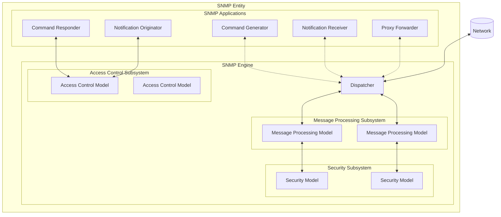
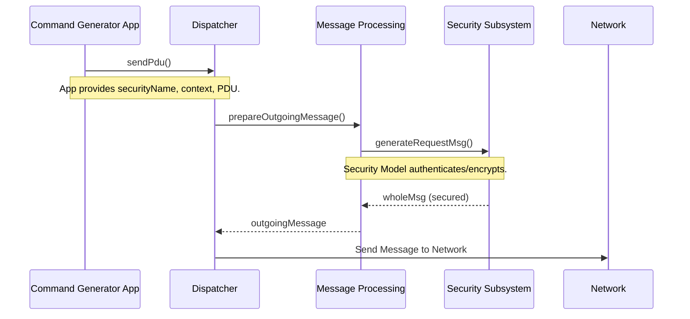

### 🏛️ Executive Summary: What is RFC 3411?

**RFC 3411, "An Architecture for Describing SNMP Management Frameworks,"** is the constitutional document for SNMPv3. It provides a modular, abstract architecture that allows different SNMP versions (v1, v2c, v3) and future enhancements to coexist and work together seamlessly.

Its primary achievement is the **separation of concerns**, cleanly dividing the complex task of network management into discrete, pluggable subsystems. This is why SNMPv3 can have strong security while still being backward-compatible.

---

### 🎯 Core Goals and Design Philosophy

The architects of SNMPv3 had clear, pragmatic goals:

| Goal                         | Explanation                                                                                                    |
| :--------------------------- | :------------------------------------------------------------------------------------------------------------- |
| **Leverage Existing Work**   | Build upon the best parts of SNMPv2u and SNMPv2*, rather than starting from scratch.                           |
| **Fix the Biggest Problem**  | Address the critical lack of **secure SET operations** in SNMPv1 and v2c.                                      |
| **Enable Modular Evolution** | Allow parts of the standard to be upgraded (e.g., security algorithms) without replacing the entire framework. |
| **Ensure Longevity**         | Create a design that can adapt to future needs and technologies.                                               |
| **Maintain Simplicity**      | Keep the core simple, allowing for inexpensive, minimal implementations.                                       |

---

### 🔒 The Security Mandate: What Threats Must Be Stopped

A core part of the architecture is defining what "security" means. RFC 3411 classifies threats into two tiers:

#### 🚨 Principal Threats (MUST be protected against)

| Threat                          | Description                                                                                      | SNMPv1/v2c Vulnerability                                      |
| :------------------------------ | :----------------------------------------------------------------------------------------------- | :------------------------------------------------------------ |
| **Modification of Information** | An unauthorized entity alters a message in transit, changing a management command or data value. | **Extreme:** Community strings offer no protection.           |
| **Masquerade**                  | An entity pretends to be an authorized manager to perform unauthorized operations.               | **Extreme:** Anyone with the community string can masquerade. |

#### ⚠️ Secondary Threats (SHOULD be protected against)

| Threat                          | Description                                                                    |
| :------------------------------ | :----------------------------------------------------------------------------- |
| **Message Stream Modification** | Maliciously reordering, delaying, or replaying messages to disrupt management. |
| **Disclosure**                  | Eavesdropping on management traffic, revealing information about the network.  |

#### 🙈 Non-Threats (Explicitly NOT addressed)

| Threat                      | Reason for Exclusion                                                                                |
| :-------------------------- | :-------------------------------------------------------------------------------------------------- |
| **Denial of Service (DoS)** | Indistinguishable from common network failures; the protocol must be robust enough to handle it.    |
| **Traffic Analysis**        | Management traffic patterns are often predictable; protecting against this provides little benefit. |

---

### 🧩 The Architectural Core: The SNMP Entity

The most important concept in RFC 3411 is the **SNMP Entity**. An SNMP Entity is a complete, self-contained implementation of the architecture. It consists of two main parts:
1.  An **SNMP Engine** (the brain).
2.  One or more **SNMP Applications** (the specialized tools).

The following diagram illustrates the complete structure of an SNMP Entity, showing all its subsystems and how they relate to applications.



#### 1. The SNMP Engine (The Brain)

The Engine is the core of the entity. It provides essential services and is uniquely identified by an `snmpEngineID`. It contains four key subsystems:

| Subsystem                        | Role & Responsibility                                                                                                                        | Real-World Analogy                                                           |
| :------------------------------- | :------------------------------------------------------------------------------------------------------------------------------------------- | :--------------------------------------------------------------------------- |
| **Dispatcher**                   | The **central nervous system**. Handles sending/receiving messages, determines the SNMP version, and routes PDUs to the correct application. | A mailroom and dispatch center for a large corporation.                      |
| **Message Processing Subsystem** | The **translator**. Contains one or more Message Processing Models (v1, v2c, v3) that understand specific message formats.                   | A team of translators, each specializing in a different language.            |
| **Security Subsystem**           | The **security checkpoint**. Contains one or more Security Models (e.g., USM) that provide authentication and encryption.                    | The security desk at an airport, checking passports and scanning luggage.    |
| **Access Control Subsystem**     | The **authorization gate**. Contains Access Control Models (e.g., VACM) that decide if a user is allowed to access specific data.            | A building manager who holds the keys and decides who can enter which rooms. |

#### 2. SNMP Applications (The Specialized Tools)

Applications use the services of the SNMP Engine. An entity can host multiple applications, defining its role (manager, agent, etc.).

| Application                 | Role                                                                                        | Typically Resides On... |
| :-------------------------- | :------------------------------------------------------------------------------------------ | :---------------------- |
| **Command Generator**       | Generates `Get`, `GetNext`, `GetBulk`, and `Set` requests.                                  | Manager                 |
| **Command Responder**       | Responds to `Get` and `Set` requests by accessing the local MIB.                            | Agent                   |
| **Notification Originator** | Generates `Trap` or `Inform` messages to alert managers.                                    | Agent                   |
| **Notification Receiver**   | Listens for and processes `Trap` and `Inform` messages.                                     | Manager                 |
| **Proxy Forwarder**         | Forwards SNMP messages between different entities, potentially converting between versions. | Proxy Server            |

---

### 🏷️ The Three Types of Naming

**FC 3411** introduces a precise vocabulary to avoid confusion.

#### 1. Naming of Entities & Identities

This is about **who** is performing an action.

| Term                            | Definition                                                             | Example                                             |
| :------------------------------ | :--------------------------------------------------------------------- | :-------------------------------------------------- |
| **Principal**                   | The "who" on whose behalf an operation is performed.                   | A person, a role, an application.                   |
| **securityName**                | A human-readable string representing the principal. Model-independent. | `"admin"`, `"readonly-user"`                        |
| **Model-dependent security ID** | The Security Model's internal representation of the principal.         | A community string (`"public"`), a username in USM. |

#### 2. Naming of Management Information

This is about **what** data is being accessed. SNMPv3 introduces the powerful concept of a **Context** to solve the problem of identifying data in complex systems (e.g., devices with multiple virtual routers).

| Term                | Definition                                                           | Purpose                                                                  |
| :------------------ | :------------------------------------------------------------------- | :----------------------------------------------------------------------- |
| **SNMP Context**    | A collection of management information accessible by an SNMP entity. | A "virtual view" or "instance" of a MIB.                                 |
| **contextEngineID** | Identifies the **SNMP Engine** that holds the context.               | Uniquely identifies the device/entity.                                   |
| **contextName**     | A name that identifies the **context** within an engine.             | `"vrtr-A"`, `"bridge-1"`, `""` (the default context).                    |
| **scopedPDU**       | The combination of `contextEngineID`, `contextName`, and the `PDU`.  | The fully-qualified, unambiguous address for a piece of management data. |

**Visualizing Contexts:**
Imagine a single physical router that acts as two logical routers (VRF-A and VRF-B). The same MIB object (e.g., `ifDescr.1`) exists in two different contexts.

```
SNMP Entity (EngineID: 800002b804616263)
|
|-- Context "VRF-A" (contextName: "vrf-a")
|   |-- ifDescr.1 = "Connection to Core A"
|   `-- ipRouteTable... (routes for VRF-A)
|
`-- Context "VRF-B" (contextName: "vrf-b")
    |-- ifDescr.1 = "Connection to Core B"  <-- Same OID, different value!
    `-- ipRouteTable... (routes for VRF-B)
```

To uniquely identify the description of the first interface in VRF-B, you need:
*   **contextEngineID:** `800002b804616263`
*   **contextName:** `"vrf-b"`
*   **Object Type:** `ifDescr`
*   **Instance:** `1`

---

### 🤝 Abstract Service Interfaces: The "Contracts"

To ensure the modular subsystems can work together, RFC 3411 defines **Abstract Service Interfaces** (ASIs). These are not APIs, but precise descriptions of the services one subsystem provides to another, including the parameters they take.

Think of them as legal contracts between software components.

**Key Primitives (Service Calls):**

| Primitive                | From `->` To                       | Purpose                                                       |
| :----------------------- | :--------------------------------- | :------------------------------------------------------------ |
| `sendPdu`                | Application `->` Dispatcher        | "Please send this PDU to a remote entity."                    |
| `processPdu`             | Dispatcher `->` Application        | "Here is an incoming PDU for you to handle."                  |
| `prepareOutgoingMessage` | Dispatcher `->` Message Processing | "Please package this data into an SNMP message."              |
| `generateRequestMsg`     | Message Processing `->` Security   | "Please secure this outgoing message (authenticate/encrypt)." |
| `processIncomingMsg`     | Message Processing `->` Security   | "Please validate the security of this incoming message."      |
| `isAccessAllowed`        | Application `->` Access Control    | "Is this principal allowed to read this object?"              |

**Example Flow: A Manager Sending a Get Request**



---

### 📊 The SNMP-FRAMEWORK-MIB

The architecture includes a MIB module to instrument and manage the SNMP Engine itself. This is crucial for remote management and monitoring.

**Key Managed Objects:**

| Object                     | Syntax         | Description                                                               |
| :------------------------- | :------------- | :------------------------------------------------------------------------ |
| `snmpEngineID`             | `SnmpEngineID` | The unique identifier for this engine. **Must persist across reboots.**   |
| `snmpEngineBoots`          | `Integer32`    | Number of times the engine has re-initialized.                            |
| `snmpEngineTime`           | `Integer32`    | Seconds since `snmpEngineBoots` last changed. Used for timeliness checks. |
| `snmpEngineMaxMessageSize` | `Integer32`    | The maximum message size this engine can process.                         |

**Textual Conventions (New Data Types):**

The RFC defines several new data types for clarity:
*   `SnmpEngineID`: A special OCTET STRING for uniquely identifying engines.
*   `SnmpSecurityModel`: An INTEGER identifying a Security Model (e.g., 1=SNMPv1, 2=SNMPv2c, 3=USM).
*   `SnmpSecurityLevel`: An INTEGER representing `noAuthNoPriv(1)`, `authNoPriv(2)`, `authPriv(3)`.
*   `SnmpAdminString`: A UTF-8 string for human-readable administrative information.

---

### 🛠️ IANA Considerations

RFC 3411 creates three new registries managed by IANA to ensure interoperability:

| Registry                      | Purpose                              | Range                     |
| :---------------------------- | :----------------------------------- | :------------------------ |
| **Security Models**           | Identify standard security models.   | 0-255 (e.g., 3 is USM)    |
| **Message Processing Models** | Identify standard message formats.   | 0-255 (e.g., 3 is SNMPv3) |
| **SnmpEngineID Formats**      | Identify the format of the EngineID. | 6-127                     |

---

### ✅ Conclusion: The Power of the Architecture

**RFC 3411** is the master plan that made SNMPv3 a success. By defining a modular architecture with:

*   **Pluggable Subsystems:** You can swap Security Models without touching the Message Processing.
*   **Clear Abstract Interfaces:** Components interact in a standardized way.
*   **Precise Naming:** Eliminates ambiguity about entities, identities, and data.
*   **Explicit Security Goals:** Clearly states what threats must be mitigated.

It transformed SNMP from a simple, insecure protocol into a robust, secure, and future-proof management framework. It's the reason why we can have a single network with SNMPv1, v2c, and v3 devices all managed from a single, secure SNMPv3 management station.