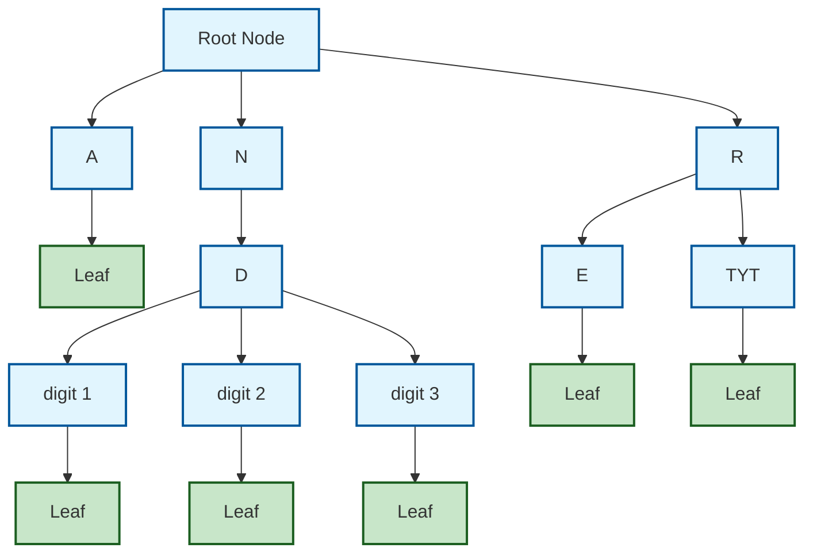

### This diagram shows:
- **Root node** with three children: A, N, R
- **Node N** has one child D
- **Node D** has three children (digit 1, digit 2, digit 3) leading to leaf nodes
- **Node R** has two children: E and TYT
- All paths eventually lead to **leaf nodes** (green)

The structure demonstrates how ART uses **adaptively sized nodes** - some nodes have many children (like D), while others have few children, showing the space-efficient adaptive nature of the data structure.

>  If each node of a tree has a positive budget, then that tree uses less than x bytes per key.
>

The Node Budget is:

A virtual "cost" that shows how much memory a node "consumes" or "saves" in relation to its children.
> The budget proves that ART will always find a sufficiently "economical" node configuration to fit into 52 bytes per key in the worst case!