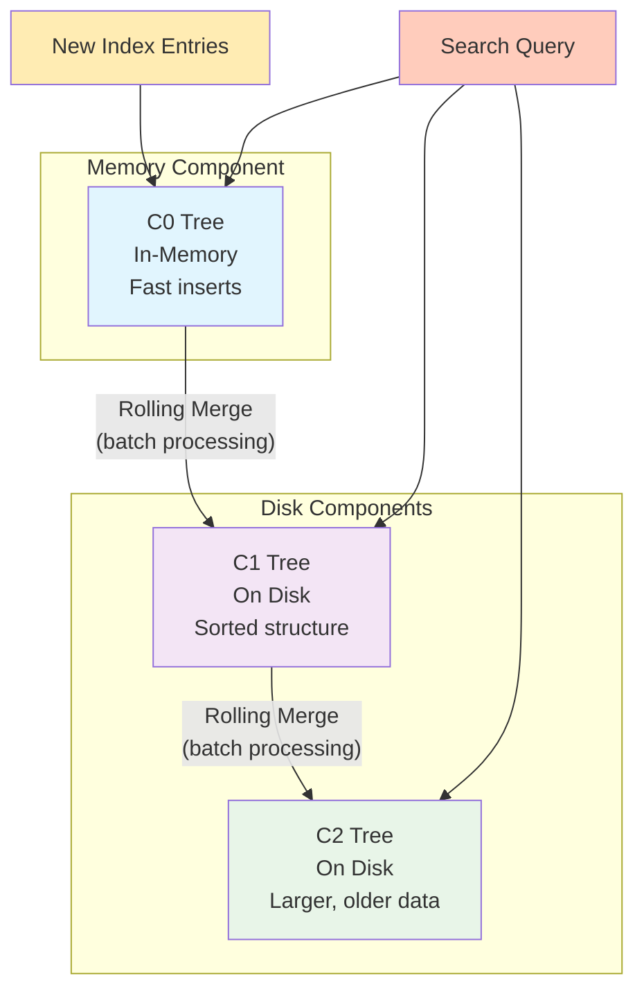

# [The Log-Structured Merge-Tree](https://www.cs.umb.edu/~poneil/lsmtree.pdf) (LSM-Tree) 

**Authors:** Patrick O'Neil¹, Edward Cheng², Dieter Gawlick³, Elizabeth O'Neil ¹
**Publication:** *Acta Informatica* (to be published)

---


---

***Diagram illustrating compaction of data in a log-structured merge tree***

##  ANNOTATION

High-performance transactional systems often insert rows into the **History table** to create an activity log. At the same time, the system generates **log records** to recover from failures. Both types of information benefit from efficient indexing.

**Real-life example:** 
Imagine a modified TPC-A benchmark where you need to quickly query the transaction history for specific bank accounts. To do this, you need an index by `account-id` in the fast-growing `History` table.

**The problem:** 
Standard on-disk index structures, such as a **B-tree**, practically **double** the cost of I/O operations to support such an index in real time, increasing the total cost of the system to **50%**!

**Solution:** 
**Log-Structured Merge-tree (LSM-tree)** is a disk—based data structure designed for **inexpensive indexing** of a file with highly intensive record inserts (and deletions) over time.

**How does it work?** 
The LSM tree uses an algorithm that **defers and groups** index changes, cascading them from a component in memory through one or more disk components. This process resembles **merge sort**. During this process, all index values remain searchable (except for very short lock periods).



## 📝 Explanations for each line of the diagram:

**`subgraph A [Memory Component]`** - start of block A, representing an in-memory component
- **Memory Component** - in-memory component, fast, but limited in size

**`C0[C0 Tree<br/>In-Memory<br/>Fast inserts]`** - definition of node C0
- **C0 Tree** - the first tree of the LSM tree, located entirely in RAM
- **In-Memory** - stored in RAM, ensures maximum speed
- **Fast inserts** - fast inserts, as they do not require disk operations

**`subgraph B [Disk Components]`** - start of block B, representing disk components
- **Disk Components** - components on the hard drive, slower but with greater capacity

**`C1[C1 Tree<br/>On Disk<br/>Sorted structure]`** - definition of node C1
- **C1 Tree** - the second tree of the LSM tree, located on disk
- **On Disk** - stored on a hard drive or SSD
- **Sorted structure** - sorted structure for efficient searching

**`C2[C2 Tree<br/>On Disk<br/>Larger, older data]`** - definition of node C2
- **C2 Tree** - the third tree of the LSM tree, the largest component
- **On Disk** - stored on disk
- **Larger, older data** - contains the largest amounts of data and the oldest records


**`C0 -- "Rolling Merge<br/>(batch processing)" --> C1`** - relationship between C0 and C1
- **Rolling Merge** - the process of "rolling merge," gradually moving data
- **Batch processing** - batch processing, grouping multiple operations together
- Shows the migration of data from memory to disk

**`C1 -- "Rolling Merge<br/>(batch processing)" --> C2`** - relationship between C1 and C2
- A similar merge process between disk components
- Moving data from a smaller disk component to a larger one

**`I[New Index Entries] --> C0`** - new data flow
- **New Index Entries** - new index entries
- All new data first goes to the C0 component in memory

**`Q[Search Query] --> C0`** - search query path
- **Search Query** - search query
- Search starts from C0 (the fastest component)

**`Q --> C1`** - continue searching
- If data is not found in C0, the search continues in C1

**`Q --> C2`** - end of search
- If data is not found in the previous components, the search continues in C2

**Styles (style commands)** - define colors for visually distinguishing components:
- **C0** - blue (memory)
- **C1** - purple (first disk level)
- **C2** - green (second disk level)
- **I** - yellow (new data)
- **Q** - orange (queries)
 
---

**Advantage:** 
The algorithm significantly reduces disk head movements compared to traditional access methods such as B-tree, and improves the price-performance ratio in cases where the cost of insertion operations for traditional methods exceeds the cost of data storage.

**However, there is a caveat:** 
In some cases, search queries that require an immediate response lose I/O efficiency. Thus, the LSM tree is most useful in applications where **index inserts are more common** than record searches. This is a common property for history tables and log files.

---

# The Five Minute Rule

## Rule Formulation

**The Five Minute Rule** is an economic principle for optimizing data storage systems that states:

> Data pages should be stored in RAM rather than on disk if they are accessed more frequently than once every 60 seconds.

## Mathematical Basis

The rule is based on the cost ratio:

```
COST_P / COST_m
----------------
page size in MB
```

where:
- **COST_P** is the amortized cost of a disk controller providing 1 IOPS
- **COST_m** is the cost of storing one page in RAM, amortized over one second

## Historical Context

- **1987**: Original formulation - 5 minutes (300 seconds)
- **1995**: Period reduced to 60 seconds
- **Reasons for change**:
- Technical differences in buffering assumptions
- Advent of mass production of inexpensive disk drives
- Faster decline in memory prices compared to disk systems

## Economic Principle

The rule implements a simple economic tradeoff:

**Cost of additional memory** vs. **Additional Disk Subsystem Costs**

When a page's access frequency exceeds a threshold (approximately once every 60 seconds), it becomes more cost-effective to store the page in RAM than to continuously perform disk I/O.

## Development Outlook

The threshold is expected to continue to increase in the future, as memory prices decline faster than disk systems.

## Practical Application

In the context of the examples in the article, this rule explains:
- Why the Branch and Teller tables must be entirely in-memory
- Why the Account table pages cannot be memory-resident
- Why the index for the History table will not be effectively buffered in memory when using a B-tree
  
## Historical Evolution

| Year | Period                  | Context                           |
| ---- | ----------------------- | --------------------------------- |
| 1987 | 5 minutes               | Originally formulated by Jim Gray |
| 1997 | 1-2 minutes             | Update for new hardware prices    |
| 2007 | 1-5 minutes             | Introduction of SSDs              |
| 2024 | 30 seconds - 10 minutes | Depends on storage type           |

## Modern Thresholds for Different Technologies

### **DRAM vs. SSD:**
- **High-Performance SSDs**: 30-60 seconds
- **Standard SSDs**: 2-5 minutes
- **Low-End SSDs**: 5-10 minutes

### **DRAM vs. HDD:**
- **HDD**: 10-30 minutes (due to slow access)